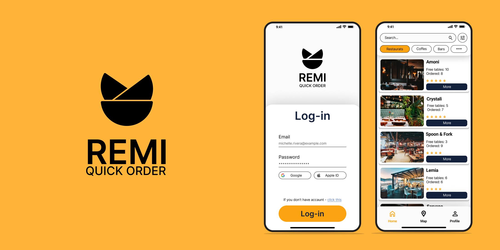

# Remi

## Description
Remi - is app wrote on flutter framework for order 
tables in restaurants, coffees and another places.

---

## App Design
Link to Figma: https://www.figma.com/file/o0w1z3CFn3bEFpY9vwu5fw/App-REMI?node-id=20%3A151 

---

## API Server
API server writed on Node.js in folder src/server.

## Download builds
    Since the application is not completed yet There are no build yet.

    If you want start debug on Windows application not be started because it's return ERROR FIREBASE.
