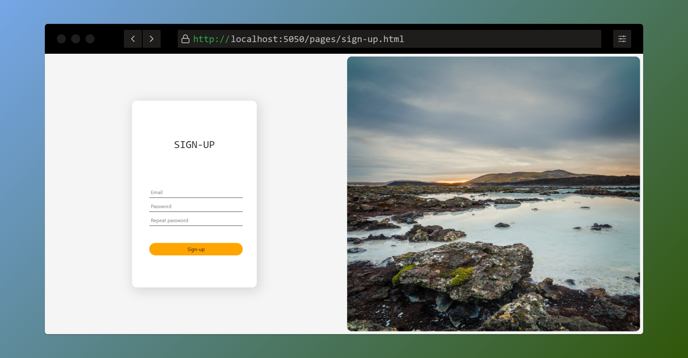
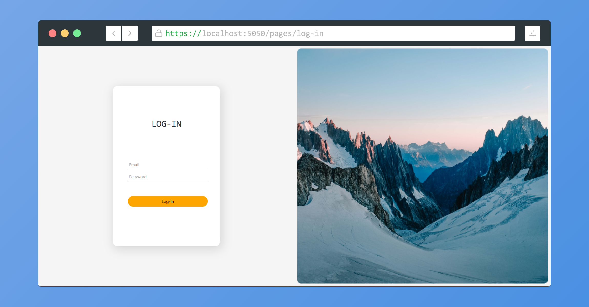
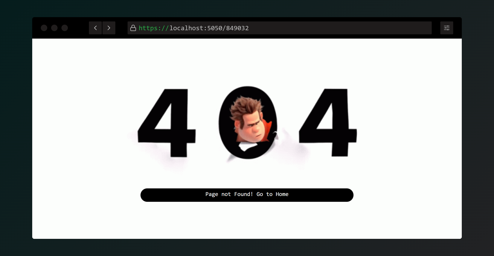

# API Server for Remi
API Server writed on Node.js, Express.js + SQLite and another CSS and JS libraries.

For install all dependencies use this command in project folder
```
    > npm install
```

## Run 
For developer mode use
```
    > npm run dev
```
Or click to [start.bat](/start.bat) if your Platform is Windows.

For release mode use
```
    > npm run start
```

## Screenshots
SignUp page

LogIn page

404 Page Not Fouund

